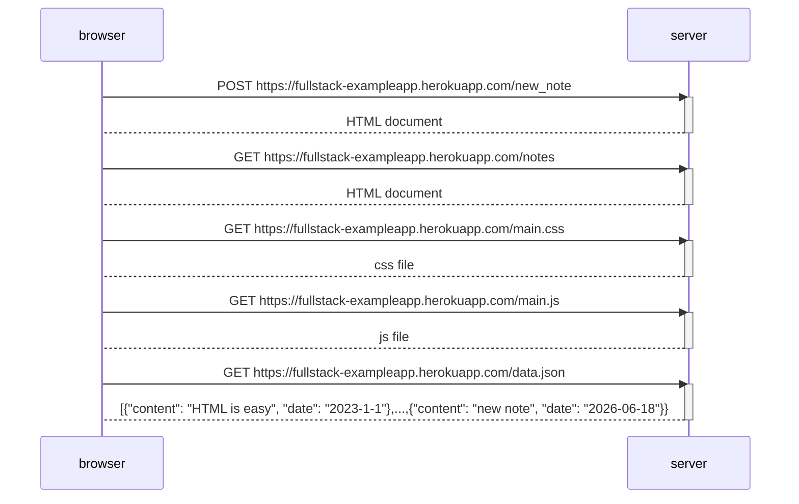

```mermaid
sequenceDiagram
    participant browser
    participant server

    browser->>server: POST https://fullstack-exampleapp.herokuapp.com/new_note
    activate server
    server-->browser: HTML document
    deactivate server

    browser->>server: GET https://fullstack-exampleapp.herokuapp.com/notes
    activate server
    server-->browser: HTML document
    deactivate server

    browser->>server: GET https://fullstack-exampleapp.herokuapp.com/main.css
    activate server
    server-->browser: css file
    deactivate server

    browser->>server: GET https://fullstack-exampleapp.herokuapp.com/main.js
    activate server
    server-->browser: js file
    deactivate server

    browser->>server: GET https://fullstack-exampleapp.herokuapp.com/data.json
    activate server
    server-->browser: [{"content": "HTML is easy", "date": "2023-1-1"},...,{"content": "new note", "date": "2026-06-18"}}
    deactivate server
```
